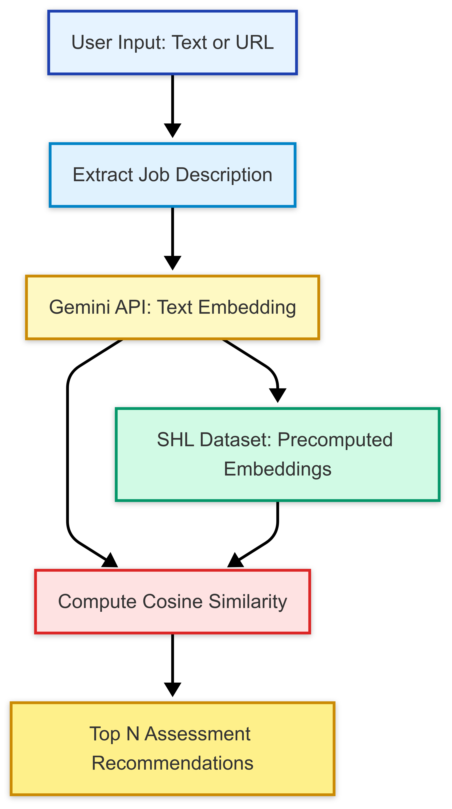

# SHL Assessment Recommender

An intelligent recommender system that suggests the most relevant **SHL assessments** for a given job description or job posting URL. Powered by **Google Gemini** embeddings and built with **Streamlit** for an interactive experience.


## 🌟 Features

✅ Input a job description (text or URL)  
✅ Extract and clean job content from live job portals  
✅ Generate semantic embeddings using **Gemini API**  
✅ Recommend top-matching SHL assessments from a curated dataset  
✅ Interactive and responsive Streamlit frontend  
✅ Smart web scraping and classification for enriched SHL data  


##  Architecture Overview

<p align="center">
  
</p>
<!-- PLACEHOLDER: Paste your architecture diagram here (PNG, SVG, etc.) -->

> _Diagram shows the flow from user input → Gemini Embedding → Similarity Matching → Recommendations._


## 🚀 Quick Start

### 1. Clone the Repository

```bash
git clone https://github.com/your-username/shl-assessment-recommender.git
cd shl-assessment-recommender
```

### 2. Install Dependencies

```bash
pip install -r requirements.txt
```

### 3. Configure API Key (for local development)

Create a file: `.streamlit/secrets.toml`  
```toml
GEMINI_API_KEY = "your_gemini_api_key"
```

> ✅ Do **not** commit this file to GitHub. Add it to `.gitignore`.


## 🌐 Deployment on Streamlit Cloud

1. Push your code to GitHub
2. Go to [streamlit.io/cloud](https://streamlit.io/cloud)
3. Connect your GitHub repo
4. In your app settings → Secrets → add:

```
GEMINI_API_KEY = your_gemini_api_key
```

5. Streamlit will automatically load this secret in your app using `st.secrets["GEMINI_API_KEY"]`.


## 🧩 Project Structure

```bash
├── app.py                  # Streamlit interface
├── recommender.py          # Embedding + similarity engine
├── crawler.py              # SHL catalog scraper and embedder
├── shl_assessments.csv     # Dataset of SHL assessments (pre-embedded)
├── requirements.txt        # Required libraries
├── .streamlit/
│   └── secrets.toml        # (local only - not committed)
└── README.md               # This file
```


## 🛠️ How it Works

1. User enters job description or URL
2. Description is embedded using **Gemini**
3. Pre-embedded SHL assessments are loaded
4. Cosine similarity is computed
5. Top N assessments are recommended with links & metadata


## 📉 Example Assessment Output

```text
1. SHL Verify Numerical Reasoning (Similarity: 0.8945)
   Description: Assesses numerical data interpretation skills...
   Test Type: Knowledge & Skills
   [Link to Assessment](https://www.shl.com/solutions/products/verify-numerical/)
```


## 📦 Crawling and Generating the Dataset

You can update or regenerate the `shl_assessments.csv` dataset by running:

```bash
python crawler.py
```

This will:
- Scrape assessment details from SHL
- Classify and embed descriptions using Gemini
- Store everything in a ready-to-use CSV

---

##  Technologies Used

- 🧠 Google Gemini API (text embeddings)
- 🌍 BeautifulSoup (web scraping)
- 📊 scikit-learn (cosine similarity)
- 🕸️ Streamlit (frontend UI)
- 🐼 pandas, numpy
